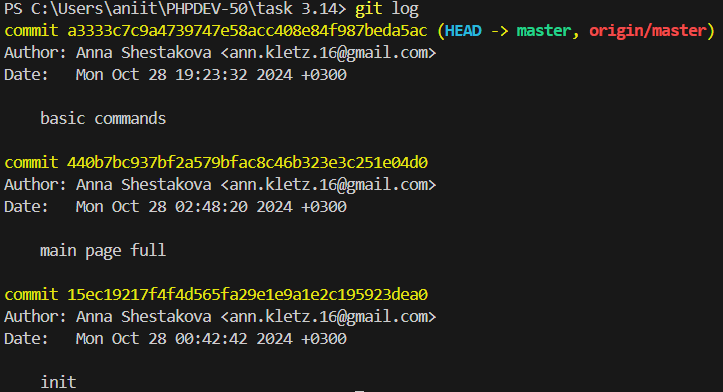

## GIT LOG

`Git log` отображает информацию о коммитах в обратном хронологическом порядке (от последнего к первому). 

**Информация, которая предоставляется командой `git log`:**
1. Хэш коммита
2. Автор коммита
3. Дата коммита
4. Сообщение коммита

#### Пример команды:
```
git log
```

**Пример отображаемой информации:**



[**< На главную**](./readme.md)