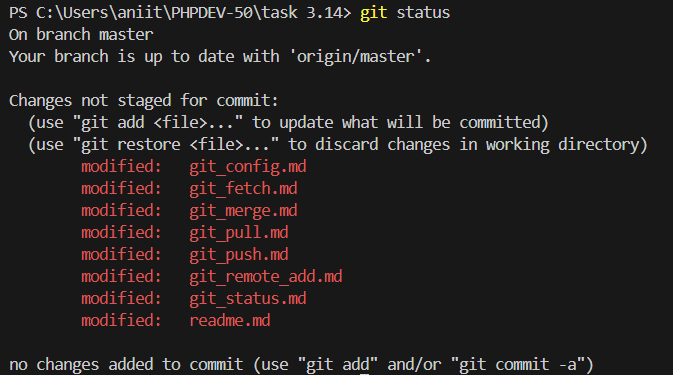

## GIT STATUS

команда `git status` выводит информацию о текущем состоянии репозитория: позволяет отследить какие файлы добавлены в индкес, какие файлы необходимо первоначально подготовить к коммиту с помощью команды [`git add`](./git_add.md), а также какие сохраненные файлы были изменены в репозитории.

#### Пример команды, вводимой в терминал:
```
git status
```

**Пример отображаемой информации:**



[**< На главную**](./readme.md)